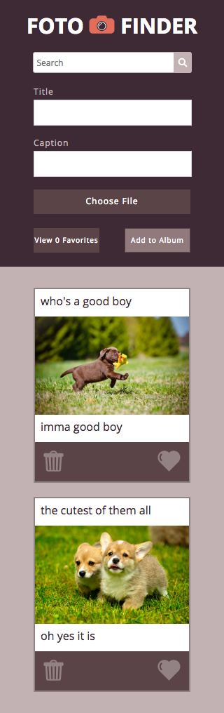

# Foto Finder

This is a web application designed to store a user's photos. A photo card is made up a title, a caption, and a delete and "favorite" button, all of which are created and stored locally within a separate class (Foto). The localStorage objects are retrieved and placed on the DOM accordingly. 

Main funcationality includes: Creating and deleting photos, manipulating the "favorite" boolean value and sorting accordingly, and filtering photos through their title or caption. 

The Foto-Finder application is supported on mobile devices up to 320px wide. 

## Desktop Version

## Mobile Version

## Original Comp

